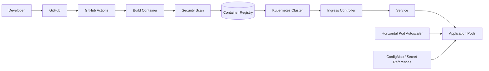

# Kubernetes CI/CD Platform

Production-style Kubernetes platform project focused on container delivery, environment separation, autoscaling, ingress, security controls, and CI/CD automation.

> **Portfolio status:** implementation is being built in this repository. Runtime deployment is only considered verified after the manifests/Helm chart are deployed to a Kubernetes cluster and tested.

## Target architecture



## What this project demonstrates

- containerized application with health endpoints
- Kubernetes Deployment, Service, Ingress, ConfigMap, HPA, and PodDisruptionBudget
- readiness, liveness, and startup probes
- CPU/memory requests and limits
- rolling-update strategy and rollback workflow
- Kustomize base + dev/prod overlays
- Helm chart for reusable releases
- GitHub Actions CI/CD
- container and Kubernetes security scanning
- environment-specific configuration
- operational and deployment documentation

## Repository structure

```text
kubernetes-cicd-platform/
├── app/
├── k8s/
│   ├── base/
│   └── overlays/
│       ├── dev/
│       └── prod/
├── helm/
│   └── platform-app/
├── .github/workflows/
├── docs/
├── scripts/
├── Dockerfile
├── .dockerignore
├── .gitignore
└── README.md
```

## Design principles

The application runs as a non-root container, uses health probes, has explicit resource boundaries, and is designed for horizontal scaling. Kubernetes configuration is separated into a reusable base and environment overlays. CI validates code and manifests before deployment-oriented stages are allowed to run.

## Current status

**Foundation in progress.** The repository structure and first application/Kubernetes layer are being implemented now.
