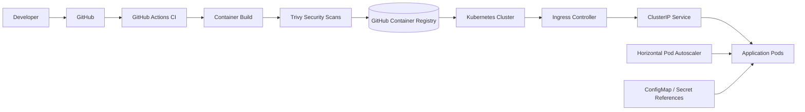

# Kubernetes CI/CD Platform

Production-style Kubernetes platform project focused on container delivery, environment separation, autoscaling, ingress, security controls, Helm packaging, and CI/CD automation.

> **Portfolio status:** repository implementation is complete. Runtime deployment is **not claimed as verified** until the workload is deployed to a real Kubernetes cluster and the rollout, ingress, autoscaling, and health checks are tested.

## Architecture



## What this project demonstrates

- containerized Python application with health endpoints
- hardened non-root container runtime
- Kubernetes Deployment, Service, Ingress, ConfigMap, HPA, PodDisruptionBudget, and NetworkPolicy
- startup, readiness, and liveness probes
- CPU and memory requests/limits
- rolling updates with zero planned unavailable replicas
- Kustomize base with dev/prod overlays
- reusable Helm chart
- GitHub Actions CI for manifest rendering, Helm validation, builds, and security scanning
- GitHub Actions release workflow publishing immutable images to GHCR
- packaged Helm release artifact
- environment-specific configuration
- deployment verification script
- deployment, rollback, security, and architecture documentation

## Repository structure

```text
kubernetes-cicd-platform/
├── app/
├── k8s/
│   ├── base/
│   └── overlays/
│       ├── dev/
│       └── prod/
├── helm/
│   └── platform-app/
├── .github/workflows/
│   ├── ci.yml
│   └── release.yml
├── docs/
│   ├── architecture.md
│   ├── deployment.md
│   ├── rollback.md
│   └── security.md
├── scripts/
│   └── verify-deployment.sh
├── Dockerfile
├── .dockerignore
├── .gitignore
└── README.md
```

## Engineering decisions

### Hardened workload

The application is designed to run without root privileges. Kubernetes enforces `runAsNonRoot`, RuntimeDefault seccomp, no privilege escalation, a read-only root filesystem, and dropped Linux capabilities.

### Health-aware delivery

Startup, readiness, and liveness probes separate application startup from traffic readiness and runtime health. Rolling updates use `maxUnavailable: 0` and `maxSurge: 1`.

### Scaling and resilience

The platform uses multiple replicas, CPU-based horizontal autoscaling, resource requests/limits, and a PodDisruptionBudget. Real availability still depends on the Kubernetes cluster and node/infrastructure topology.

### Environment separation

Kustomize provides a reusable base plus dev/prod overlays. Helm provides a reusable packaging and release path. These are intentionally both present to demonstrate two common platform-delivery patterns.

### Supply-chain checks

CI builds the image and uses Trivy to scan both the container image and Kubernetes/Helm configuration for high and critical findings. Release images are tagged with the Git commit SHA rather than relying only on mutable tags.

## Local validation

```bash
kubectl kustomize k8s/overlays/dev
kubectl kustomize k8s/overlays/prod
helm lint helm/platform-app
helm template platform-app helm/platform-app
docker build -t platform-app:local .
```

## Deployment

Kustomize:

```bash
kubectl apply -k k8s/overlays/dev
```

Helm:

```bash
helm upgrade --install platform-app helm/platform-app \
  --namespace platform-app \
  --create-namespace \
  --set image.tag=<immutable-image-tag>
```

See `docs/deployment.md` for the full workflow and `docs/rollback.md` for rollback procedures.

## CI / release workflows

`ci.yml` validates the application, renders dev/prod Kustomize manifests, lints/renders the Helm chart, builds the image, and performs security scans.

`release.yml` publishes commit-SHA-tagged images to GitHub Container Registry and packages the Helm chart as a workflow artifact. Cluster deployment remains environment-specific and requires explicit cluster authentication rather than credentials stored in this repository.

## Security

No real secrets belong in Git. Non-sensitive runtime configuration is provided through ConfigMaps/values. Production secrets should be injected through a secure secret-management integration. See `docs/security.md`.

## Runtime verification

After a real deployment, run:

```bash
NAMESPACE=platform-app DEPLOYMENT=platform-app ./scripts/verify-deployment.sh
```

For the Helm release, adjust the deployment name if needed based on the Helm release name.

## Current status

**Repository implementation: complete. Runtime deployment: unverified.**

The next meaningful improvement is not adding random Kubernetes objects. It is deploying to a real cluster, capturing successful rollout/security evidence, and documenting the result without exposing credentials or sensitive cluster information.
