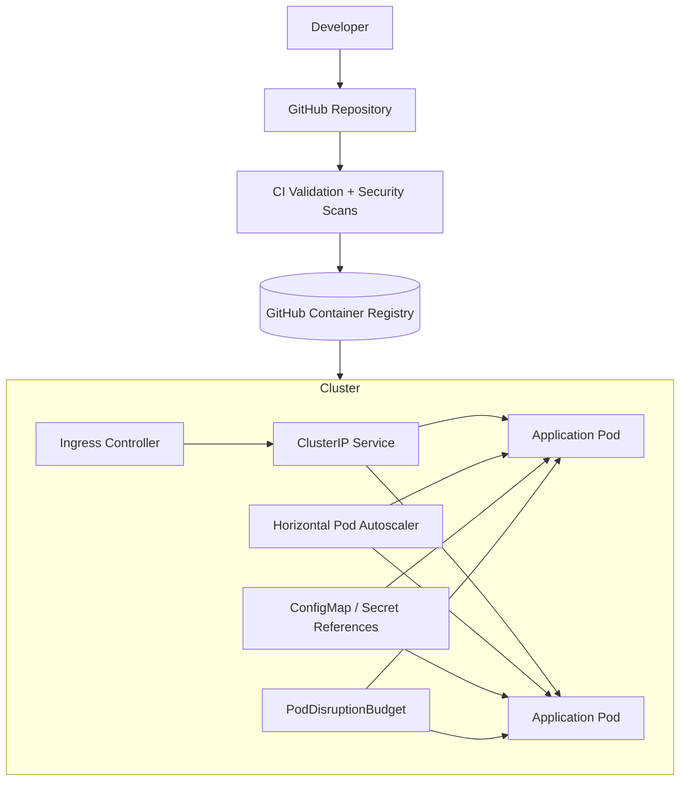

# Platform Architecture

## Delivery model

Pull requests and pushes are validated through GitHub Actions. The pipeline renders environment manifests, validates Helm output, builds the container, and performs security scanning. A separate deployment workflow can publish immutable images to GHCR and deploy through Helm when explicit cluster credentials are configured.

## Environment model

Kustomize provides a reusable base with `dev` and `prod` overlays. Helm provides a second packaging path for reusable application releases. The two approaches demonstrate environment composition and release packaging without claiming that both must be used simultaneously in a real organization.

## Availability and scaling

The workload uses multiple replicas, rolling updates, readiness gating, a PodDisruptionBudget, and CPU-based horizontal autoscaling. These controls improve workload resilience, but real availability still depends on the cluster, ingress controller, node topology, and infrastructure beneath Kubernetes.
